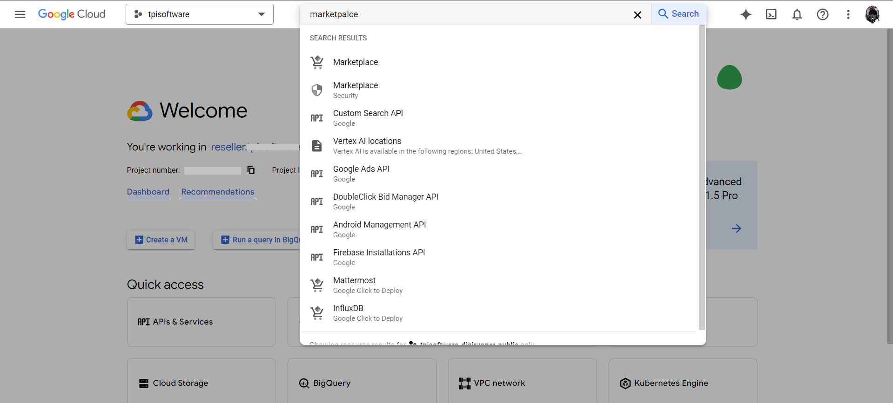

# Architecture (TEST)


# Installation
### Please surf to https://cloud.google.com/ and login with your user account.
### It is recommended to use cloud shell for installation
- Click the "Activate Cloud Shell" button up top on the right.

- A cloud shell terminal will be launched for the current project.

---

# Quick install with Google Cloud Marketplace

Install this digiRunner app to a Google Kubernetes Engine cluster using Google Cloud Marketplace. Follow the on-screen instructions.

# Prerequisites
### 1. You will need a `GKE cluster` and a`PostgreSQL` database. 
 - Use the following command to create `GKE cluster` and  `Cloud SQL` database.
 - digiRunner needs database and domain, setting up `DB password` and `Domain name`.
 - Replace the variable of `CLUSTER_NAME`, `DB_INSTANCE`, `DB_PASSWORD`, `REGION`, `ZONE` and `LOCATION`.
 - Please note that `environment variables` set in the cloud shell will be lost upon session termination. You must re-`export` environment variables after each session.
 - The `PROJECT_ID`, `PROJECT_NUM` and `OPERATOR` variables. These variables will be referenced in subsequent steps.
 - Minimum `machine-type` requirement is n2d-standard-2 or higher.
 - Create a database with the name `digirunner`, please don't edit this database name.

 |Command Line|Descriptions|User-Defined Value|
 |-|-|-|
export CLUSTER_NAME="digi-cluster"|Create GKE cluster.|digi-cluster
export DB_INSTANCE="digi-postgres"|Create Cloud SQL database.|digi-postgres
export DB_PASSWORD="DeFault_pW"|Set up your DB password.|DeFault_pW
export REGION="asia-east1"|Set up the domain name.|asia-east1
export ZONE="asia-east1-a"|Set up the zone name.|asia-east1-a
export LOCATION="asia-east1-a"|Set up the location.|asia-east1-a
export NAMESPACE="default"|Run at which namespace.|default
- Users can copy and paste the following commands to an editor, and modify user-defined values if needed. When the editing is done, copy the entire list of commands and paste it into the cloud shell.
```
# Replace your values.
# export CLUSTER_NAME="[user_define]"
# export DB_INSTANCE="[user_define]"
# export DB_PASSWORD="[user_define]"
# export REGION="[user_define]"
# export ZONE="[user_define]"
# export LOCATION="[user_define]"
# export NAMESPACE="[user_define]"
```
```
# Example:
export CLUSTER_NAME="digi-cluster"
export DB_INSTANCE="digi-postgres"
export DB_PASSWORD="DeFault_pW"
export REGION="asia-east1"
export ZONE="asia-east1-a"
export LOCATION="asia-east1-a"
export NAMESPACE="default"

export PROJECT_ID=`gcloud config get-value project`
export PROJECT_NUM=`gcloud projects describe $PROJECT_ID --format="value(projectNumber)"`
export OPERATOR=`gcloud config get-value account`

gcloud container clusters create $CLUSTER_NAME \
  --machine-type "n2d-standard-2" \
  --image-type "COS_CONTAINERD" \
  --disk-type "pd-ssd" \
  --disk-size "100GB" \
  --workload-pool "$PROJECT_ID.svc.id.goog" \
  --node-locations $LOCATION \
  --zone $ZONE

export NODEPOOL_NAME=`gcloud container node-pools list --zone $ZONE --cluster $CLUSTER_NAME --format="value(name)"`
gcloud container node-pools update $NODEPOOL_NAME --cluster=$CLUSTER_NAME --region=$ZONE --workload-metadata=GKE_METADATA

gcloud sql instances create $DB_INSTANCE --database-version=POSTGRES_15 --cpu=2 --memory=3.75GiB --zone=$ZONE --root-password=$DB_PASSWORD --availability-type=zonal --edition=enterprise
gcloud sql databases create digirunner --instance=$DB_INSTANCE
```
### The `K8s` and `database` infrastructure are now ready. Next, we will proceed to the marketplace to install the application.
---
### 2. You will need a `Domain Name` and `external IP`. digiRunner uses encrypted connections, so you can follow the steps below to set up an `SSL certificate`. [Refer to this step.](#create-certificates)
 - digiRunner needs domain name.
 - Replace the variable of `DIGI_DOMAIN`.
 - Reserve a new static external IP address.

|Command Line|Descriptions|User-Defined Value|
|-|-|-|
export DIGI_DOMAIN="my-digirunner.domain.com"|Set the domain name for your digiRunner.|my-digirunner.domain.com
gcloud compute addresses create dgr-ingress --global --ip-version=IPV4|To reserve a new static external IP address.|
```
# replace your domain name.
# export DIGI_DOMAIN="[user_define]"
```
```
# Example:
export DIGI_DOMAIN="my-digirunner.domain.com"
gcloud compute addresses create dgr-ingress --global --ip-version=IPV4
gcloud compute addresses describe dgr-ingress --global | grep 'address:'
```
 - After creating an `IP address`, you need to bind your domain and IP address with your `domain registrar` yourself. 
### 3. Install the Application resource definition

An Application resource is a collection of individual Kubernetes components, such as Services, Deployments, and so on, that you can manage as a group.

To set up your cluster to understand Application resources, run the following command:
You need to run this command once.
```
gcloud container clusters get-credentials $CLUSTER_NAME --location $LOCATION
kubectl apply -f "https://raw.githubusercontent.com/GoogleCloudPlatform/marketplace-k8s-app-tools/master/crd/app-crd.yaml"
```
 - Command Result:


### 4. Install the digirunner application from marketplace.
- Search for "marketplace" in the search bar.


- Search for "digirunner" or "digi" in the marketplace page.


- click the `CONFIGUE` button on the marketplace page and select the GKE cluster created above to install digirunner.


- Fill in the form information and click `DEPLOY`. 


- The deployment starts automatically. Please wait for a few seconds for application installation process to be complete.


---

# Command line instructions
### Set up command-line tools
You'll need the following tools in your development environment. If you are using Cloud Shell, then `gcloud`, `kubectl` are installed in your environment by default.

- [gcloud](https://cloud.google.com/sdk/gcloud/)
- [kubectl](https://kubernetes.io/docs/reference/kubectl/overview/)
- [envsubst](https://command-not-found.com/envsubst)

|Command Line|Descriptions|User-Defined Value|
|-|-|-|
gcloud auth configure-docker|Configure gcloud as a Docker credential helper|
gcloud services enable cloudresourcemanager.googleapis.com|Enable google apis|
```
gcloud auth configure-docker
gcloud services enable cloudresourcemanager.googleapis.com
```
 - Command Result:


---
# These YAML files will
- Deploy an Ingress, configure the domain to the Ingress
- Bind an SSL certificate
- Connect to the database via cloudsql_proxy
- Set up HPA
- And deploy the digirunner keeper service

|Command Line|Descriptions|User-Defined Value|
|-|-|-|
export IMAGE_DIGIRUNNER_APP='gcr.io/tpisoftware-digirunner-public/digirunner/digirunner:4.2.19'|Set up the keeper image version.|
git clone https://github.com/TPIsoftware-digirunner/digirunner.git; cd digirunner/|clone the k8s yaml.|
envsubst < ./yaml/manifest_ingress.yaml > ./yaml/ingress.yaml|Set up domain name manifest to ingress.|
envsubst < ./yaml/manifest_managed_cert.yaml > ./yaml/managed_cert.yaml|Set up domain name manifest to certificate.|
envsubst < ./yaml/manifest_cloudsql_proxy_mariadb.yaml > ./yaml/cloudsql_proxy_mariadb.yaml|Set up cloudsql_proxy manifest.|
envsubst < ./yaml/manifest_cloudsql_proxy_svc.yaml > ./yaml/cloudsql_proxy_svc.yaml|Set up cloudsql_proxy svc.|
envsubst < ./yaml/manifest_digi_hpa.yaml > ./yaml/digi_hpa.yaml|Set up Horizontal Pod Autoscaler (HPA).|
envsubst < ./yaml/manifest_keeper.yaml > ./yaml/keeper.yaml|Set up digiRunner keeper service.|
### Please follow the instructions below.
```
export IMAGE_DIGIRUNNER_APP='gcr.io/tpisoftware-digirunner-public/digirunner/digirunner:4.2.19'
git clone https://github.com/TPIsoftware-digirunner/digirunner.git; cd digirunner/
envsubst < ./yaml/manifest_ingress.yaml                > ./yaml/ingress.yaml
envsubst < ./yaml/manifest_managed_cert.yaml           > ./yaml/managed_cert.yaml
envsubst < ./yaml/manifest_cloudsql_proxy_mariadb.yaml > ./yaml/cloudsql_proxy_mariadb.yaml
envsubst < ./yaml/manifest_cloudsql_proxy_svc.yaml     > ./yaml/cloudsql_proxy_svc.yaml
envsubst < ./yaml/manifest_digi_hpa.yaml               > ./yaml/digi_hpa.yaml
envsubst < ./yaml/manifest_keeper.yaml                 > ./yaml/keeper.yaml
```
 - Command Result:


# How to use cloudsql_proxy for internal secure connections.
### Create a Google Cloud service account (GSA) and Kubernetes service account (KSA), Grant permissions for your Kubernetes service account (KSA) to impersonate the GSA (used by cloudsql_proxy)
|Command Line|Descriptions|User-Defined Value|
|-|-|-|
kubectl create serviceaccount mysql-ksa --namespace $NAMESPACE|Create KSA|$NAMESPACE
gcloud iam service-accounts create mysql-gsa --project=$PROJECT_ID|Create GSA|$PROJECT_ID
gcloud projects add-iam-policy-binding $PROJECT_ID --member "serviceAccount:mysql-gsa@$PROJECT_ID.iam.gserviceaccount.com" --role "roles/cloudsql.client"|Grant database service account roles|$PROJECT_ID
gcloud projects add-iam-policy-binding $PROJECT_ID --member "serviceAccount:mysql-gsa@$PROJECT_ID.iam.gserviceaccount.com" --role "roles/iam.workloadIdentityPoolAdmin"|Grant database service account roles|$PROJECT_ID
gcloud projects add-iam-policy-binding $PROJECT_ID --member "serviceAccount:mysql-gsa@$PROJECT_ID.iam.gserviceaccount.com" --role "roles/container.admin"|Grant database service account roles|$PROJECT_ID
gcloud projects add-iam-policy-binding $PROJECT_ID --member "serviceAccount:mysql-gsa@$PROJECT_ID.iam.gserviceaccount.com" --role "roles/iam.serviceAccountAdmin"|Grant database service account roles|$PROJECT_ID
gcloud projects add-iam-policy-binding $PROJECT_ID --member "serviceAccount:mysql-gsa@$PROJECT_ID.iam.gserviceaccount.com" --role "roles/iam.serviceAccountTokenCreator"|Grant database service account roles|$PROJECT_ID
gcloud projects add-iam-policy-binding $PROJECT_ID --member "serviceAccount:mysql-gsa@$PROJECT_ID.iam.gserviceaccount.com" --role "roles/iam.workloadIdentityUser"|Grant database service account roles|$PROJECT_ID
gcloud iam service-accounts keys create ./key/gsa-key.json --iam-account mysql-gsa@$PROJECT_ID.iam.gserviceaccount.com|Generic a service account key for cloudsql_proxy connection|$PROJECT_ID
kubectl create secret generic gsa-key --from-file=./key/gsa-key.json -n $NAMESPACE|store gsa-key.json to GKE secret (is used by containers to connect to Cloud SQL)|$NAMESPACE


```
kubectl create serviceaccount mysql-ksa --namespace $NAMESPACE
gcloud iam service-accounts create mysql-gsa --project=$PROJECT_ID

gcloud projects add-iam-policy-binding $PROJECT_ID --member "serviceAccount:mysql-gsa@$PROJECT_ID.iam.gserviceaccount.com" --role "roles/cloudsql.client"
gcloud projects add-iam-policy-binding $PROJECT_ID --member "serviceAccount:mysql-gsa@$PROJECT_ID.iam.gserviceaccount.com" --role "roles/iam.workloadIdentityPoolAdmin"
gcloud projects add-iam-policy-binding $PROJECT_ID --member "serviceAccount:mysql-gsa@$PROJECT_ID.iam.gserviceaccount.com" --role "roles/container.admin"
gcloud projects add-iam-policy-binding $PROJECT_ID --member "serviceAccount:mysql-gsa@$PROJECT_ID.iam.gserviceaccount.com" --role "roles/iam.serviceAccountAdmin"
gcloud projects add-iam-policy-binding $PROJECT_ID --member "serviceAccount:mysql-gsa@$PROJECT_ID.iam.gserviceaccount.com" --role "roles/iam.serviceAccountTokenCreator"
gcloud projects add-iam-policy-binding $PROJECT_ID --member "serviceAccount:mysql-gsa@$PROJECT_ID.iam.gserviceaccount.com" --role "roles/iam.workloadIdentityUser"

gcloud iam service-accounts keys create ./key/gsa-key.json --iam-account mysql-gsa@$PROJECT_ID.iam.gserviceaccount.com
kubectl create secret generic gsa-key --from-file=./key/gsa-key.json -n $NAMESPACE
```
 - Command Illustration:

 - Command Result:


Note: Along with the previous commands of exporting the variables:
```
# Please note that "environment variables" set in the cloud shell will be lost upon session termination. You must re-export environment variables after each session.

# export CLUSTER_NAME="digi-cluster"
# export DB_INSTANCE="digi-postgres"
# export DB_PASSWORD="DeFault_pW"
# export REGION="asia-east1"
# export ZONE="asia-east1-a"
# export LOCATION="asia-east1-a"
# export PROJECT_ID=`gcloud config get-value project`
# export PROJECT_NUM=`gcloud projects describe $PROJECT_ID --format="value(projectNumber)"`
# export OPERATOR=`gcloud config get-value account`
# export NAMESPACE="default"
```


### Deploy the Cloud SQL proxy pod, a sidecar service used by digiRunner for database connectivity.

 - The Cloud SQL Auth Proxy provides secure access to your Cloud SQL instance without the need for authorized networks or for configuring SSL. By using the Cloud SQL Auth Proxy, you can connect to your Cloud SQL instance securely.

- If you have your own PostgreSQL database, you need to edit the connection information in line 27 of the `cloudsql_proxy_mariadb.yaml` file.
```
kubectl apply -f ./yaml/cloudsql_proxy_svc.yaml
kubectl apply -f ./yaml/cloudsql_proxy_mariadb.yaml
```

### Users can bind KSA and GSA with the following commands.
|Command Line|Descriptions|User-Defined Value|
|-|-|-|
kubectl annotate serviceaccount default iam.gke.io/gcp-service-account=$PROJECT_NUM-compute@developer.gserviceaccount.com|Service accounts provide an identity for processes that run in Pods|
gcloud iam service-accounts add-iam-policy-binding $PROJECT_NUM-compute@developer.gserviceaccount.com --role roles/iam.workloadIdentityUser --member "serviceAccount:$PROJECT_ID.svc.id.goog[default/default]"|Add an IAM binding to allow the GSA to access services.|

```
kubectl annotate serviceaccount default iam.gke.io/gcp-service-account=$PROJECT_NUM-compute@developer.gserviceaccount.com

gcloud iam service-accounts add-iam-policy-binding $PROJECT_NUM-compute@developer.gserviceaccount.com \
    --role roles/iam.workloadIdentityUser \
    --member "serviceAccount:$PROJECT_ID.svc.id.goog[default/default]"
```
 - Command Result:

---

# How to deploy digiRunner `certificate`, `ingress`, `frontendconfig`, `HPA` and `keeper`.

 - SSL certificates are required before deploying an ingress. Run the following command to create one for your domain.

|Command Line|Descriptions|User-Defined Value|
|-|-|-|
kubectl scale --replicas=0 deployment/digirunner; sleep 10|Temporarily set replica to 0. The keeper will be granted master privileges. |
gcloud compute ssl-certificates create digi-cert --project=$PROJECT_ID --global --domains=$DIGI_DOMAIN|create certificates|$PROJECT_ID, $DIGI_DOMAIN
kubectl apply -f ./yaml/managed_cert.yaml|Set up certificates to k8s.|
kubectl apply -f ./yaml/ingress.yaml|Set up ingress and create GCP load balancing|
kubectl apply -f ./yaml/frontendconfig.yaml|Redirect http to https|
kubectl apply -f ./yaml/digi_hpa.yaml|Horizontal Pod Autoscaler (HPA)|
kubectl apply -f ./yaml/keeper.yaml|Deploying the High Availability architecture, keeper will record the container role.|

```
kubectl scale --replicas=0 deployment/digirunner; sleep 10
gcloud compute ssl-certificates create digi-cert --project=$PROJECT_ID --global --domains=$DIGI_DOMAIN

kubectl apply -f ./yaml/managed_cert.yaml
kubectl apply -f ./yaml/ingress.yaml
kubectl apply -f ./yaml/frontendconfig.yaml
kubectl apply -f ./yaml/digi_hpa.yaml
kubectl apply -f ./yaml/keeper.yaml
```

 - Command Illustration:

 - Command Result:


Note: Users need to reference the previous variables `$DIGI_DOMAIN` and `$PROJECT_ID`

---

# How to initialize database
 - Use job to initialize database and insert the schema.

|Descriptions|User-Defined Value|
|-|-|
|This job will insert schema and data rows.| $DB_PASSWORD, $DB_INSTANCE

```
kubectl apply -f - << EOF
$(curl -s https://raw.githubusercontent.com/TPIsoftware-digirunner/initialize-script/main/sql-init.yaml | sed -e "s/sed_password/$DB_PASSWORD/g" -e "s/sed_instance/$DB_INSTANCE/g")
EOF
```
 Command Result:


 - Use the following command to replace DB connections.

|Descriptions|User-Defined Value|
|-|-|
|Modify the configMap to establish connections for the specified settings with the PostgreSQL instance.| $NAMESPACE, $DB_PASSWORD|

```
kubectl get configmap properties-mounts -n $NAMESPACE -o yaml | sed "s/org.h2.Driver/org.postgresql.Driver/g ; s%jdbc:h2:mem:dgrdb;DB_CLOSE_DELAY=-1%jdbc:postgresql://cloudsql-proxy:5432/digirunner%g ; s/spring.datasource.username=sa/spring.datasource.username=postgres/g ; s/spring.datasource.password=/spring.datasource.password=$DB_PASSWORD/g ; s/spring.sql.init.mode=always/spring.sql.init.mode=never/g ; s/spring.jpa.database=h2/spring.jpa.database=PostgreSQL/g ; s/spring.h2.console.enabled=true/ /g" | kubectl replace -f -
```
 Command Result:


Note: Users need to reference the previous variables `$DB_INSTANCE`, `$DB_PASSWORD` and `$NAMESPACE`

---

# After editing the configMap, execute the following command to connect the DB connection to the Cloud SQL instance.
|Command Line|Descriptions|User-Defined Value|
|-|-|-|
kubectl rollout restart deployment digirunner-keeper -n $NAMESPACE|Rollout restart to make configmap changes effective.|$NAMESPACE
kubectl rollout restart deployment digirunner -n $NAMESPACE|Rollout restart to make configmap changes effective.|$NAMESPACE


```
kubectl rollout restart deployment digirunner-keeper -n $NAMESPACE
kubectl rollout restart deployment digirunner -n $NAMESPACE
```

 Command Result:


Note: Users need to reference the previous variables `$NAMESPACE`.

---

# Increase the replica count of the digirunner application to 2.
```
kubectl scale --replicas=2 deployment/digirunner
```

# Great job! Your digiRunner is all set up and ready to go.
