# Architecture
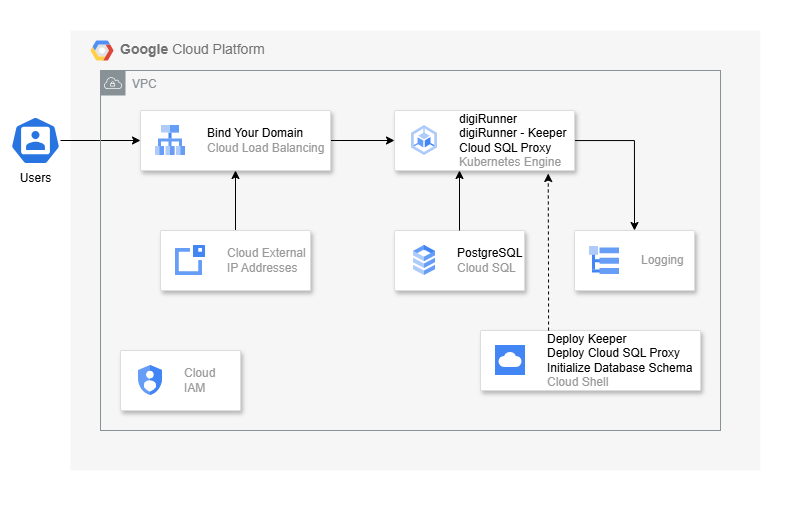<br><br>

# Installation
1. Go to [Google Cloud](https://cloud.google.com/), and login with your user account.<br>
**NOTE:**  It is recommended to use Cloud Shell for the installation process.<br>

2. Click on **Activate Cloud Shell**, the second icon in the upper right corner.
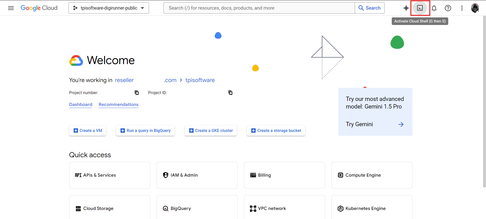<br>

3. A Cloud Shell terminal will launch for installation of the current project.
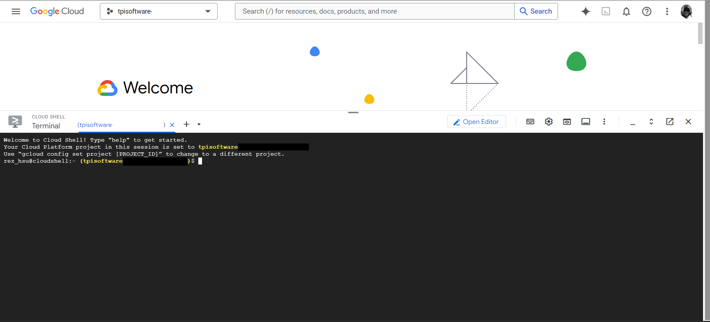<br><br>

# Quick Installation via Google Cloud Marketplace
1. Install the digiRunner app on a Google Kubernetes Engine (GKE) cluster via [Google Cloud Marketplace](https://cloud.google.com/marketplace).
2. Follow the on-screen instructions to complete the installation.

## Prerequisites
### Set up GKE Cluster and Cloud SQL Database
1. Use the commands provided below to create a GKE cluster and a PostgreSQL database.<br>
2. Set up the **database password** and specify the **domain name** for digiRunner.<br>
3. Replace the following variables in the commands: `CLUSTER_NAME`, `DB_INSTANCE`, `DB_PASSWORD`, `REGION`, `ZONE` and `LOCATION`.<br>
**NOTE:** The **environment variables** set in Cloud shell will be lost upon session termination. You must re-export the environment variables after each session.<br>
4. Ensure the variables `PROJECT_ID`, `PROJECT_NUM` and `OPERATOR` are correctly set, as they will be referenced in subsequent steps.<br>
5. Verify that the **machine type** meets the minimun requirement of **n2d-standard-2** or higher.<br>
6. Create a PostgreSQL database with the name `digirunner`. **Do not modify this database name.**<br>

 |Command Line|Description|User-defined Value|
 |-|-|-|
export CLUSTER_NAME="digi-cluster"|Define the GKE cluster name|digi-cluster
export DB_INSTANCE="digi-postgres"|Define the Cloud SQL database name|digi-postgres
export DB_PASSWORD="DeFault_pW"|Set the database password |DeFault_pW
export REGION="asia-east1"|Specify the region|asia-east1
export ZONE="asia-east1-a"|Specify the zone|asia-east1-a
export LOCATION="asia-east1-a"|Specify the location|asia-east1-a
export NAMESPACE="default"|Specify the Kubernetes namespace|default

7. Users can copy and paste the following commands into an editor, modify the values as necessary, and then copy the entire list of commands into Cloud Shell.
```
# Replace [user_define] with your values.
export CLUSTER_NAME="[user_define]"
export DB_INSTANCE="[user_define]"
export DB_PASSWORD="[user_define]"
export REGION="[user_define]"
export ZONE="[user_define]"
export LOCATION="[user_define]"
export NAMESPACE="[user_define]"
```
```
# Example:
export CLUSTER_NAME="digi-cluster"
export DB_INSTANCE="digi-postgres"
export DB_PASSWORD="DeFault_pW"
export REGION="asia-east1"
export ZONE="asia-east1-a"
export LOCATION="asia-east1-a"
export NAMESPACE="default"

export PROJECT_ID=`gcloud config get-value project`
export PROJECT_NUM=`gcloud projects describe $PROJECT_ID --format="value(projectNumber)"`
export OPERATOR=`gcloud config get-value account`

gcloud container clusters create $CLUSTER_NAME \
  --machine-type "n2d-standard-2" \
  --image-type "COS_CONTAINERD" \
  --disk-type "pd-ssd" \
  --disk-size "100GB" \
  --workload-pool "$PROJECT_ID.svc.id.goog" \
  --node-locations $LOCATION \
  --zone $ZONE

export NODEPOOL_NAME=`gcloud container node-pools list --zone $ZONE --cluster $CLUSTER_NAME --format="value(name)"`
gcloud container node-pools update $NODEPOOL_NAME --cluster=$CLUSTER_NAME --region=$ZONE --workload-metadata=GKE_METADATA

gcloud sql instances create $DB_INSTANCE --database-version=POSTGRES_15 --cpu=2 --memory=3.75GiB --zone=$ZONE --root-password=$DB_PASSWORD --availability-type=zonal --edition=enterprise
gcloud sql databases create digirunner --instance=$DB_INSTANCE
```

The **Kubernetes** and **database** infrastructure are now ready. Next, proceed to the marketplace to install the application.

### Set up Domain Name and Reserve External IP Address
A domain name and external IP address are required for setting up encrypted connections in digiRunner. Follow the steps below to complete the required setup, and refer to [this section](#deploy-digirunner-components) to proceed with the SSL certificate configuration.<br>

1. Set a domain name: Replace the `DIGI_DOMAIN` variable with your domain name.<br>
2. Reserve a static external IP address, and then retrieve the address.

|Command Line|Description|User-defined Value|
|-|-|-|
export DIGI_DOMAIN="my-digirunner.domain.com"|Set the domain name for your digiRunner.|my-digirunner.domain.com
gcloud compute addresses create dgr-ingress --global --ip-version=IPV4|To reserve a new static external IP address.|
```
# Replace [user_define] with your domain name.
export DIGI_DOMAIN="[user_define]"
```
```
# Example:
export DIGI_DOMAIN="my-digirunner.domain.com"
gcloud compute addresses create dgr-ingress --global --ip-version=IPV4
gcloud compute addresses describe dgr-ingress --global | grep 'address:'
```
3. Bind the domain name to the IP address: After retrieving the IP address, update the domain-to-IP binding through your **domain registrar**. Ensure the DNS settings point your domain to the newly reserved IP.<br>

### Install Application Resource Definition
Application resources enable you to manage Kubernetes components, such as **Services** and **Deployments**, as a group.<br>

1. To prepare your cluster to handle these resources, run the following commands once to connect to your cluster, and apply the application resource definition.

* Example Commands:
```
gcloud container clusters get-credentials $CLUSTER_NAME --location $LOCATION
kubectl apply -f "https://raw.githubusercontent.com/GoogleCloudPlatform/marketplace-k8s-app-tools/master/crd/app-crd.yaml"
```
2. The output of this command should indicate successful creation of the required resources.
* Command Output:
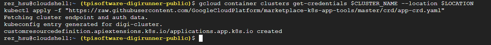

### Install the digirunner Application via Marketplace
The digiRunner application can be installed directly from Google Cloud Marketplace.
1. Open the **Marketplace** from the Google Cloud console.<br>
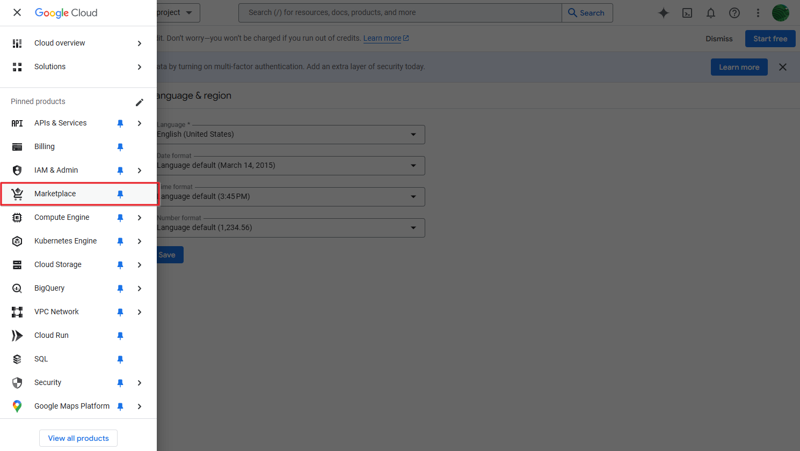<br>

2. Search for **digiRunner** or **digi** in the Marketplace.<br>
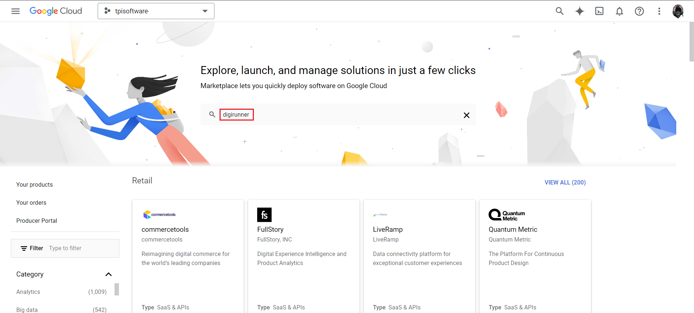<br>

3. Click **CONFIGURE** on the digiRunner page.<br>
<br>

4. Select the previously created **GKE cluster** and fill in the required fields.
5. Click **DEPLOY** to begin the installation process.<br>
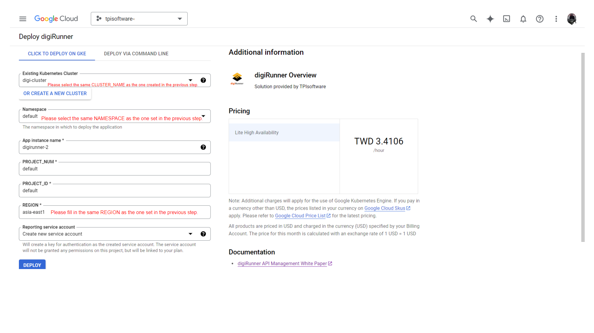
6. The deployment starts automatically. Wait for a few seconds, and the status page will confirm when the installation is complete.<br>
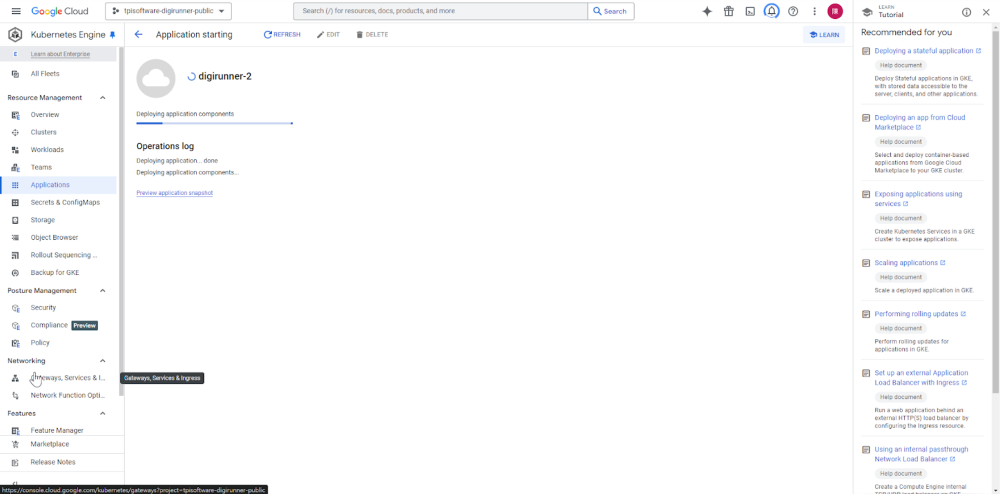<br>
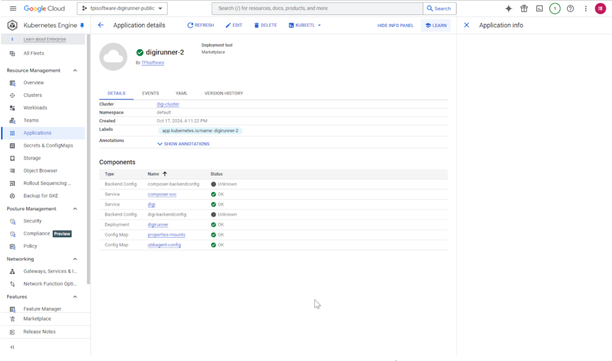<br><br>

# Command Line Instructions
## Set up Command-Line Tools
Ensure your development environment includes the following tools. If you are using Cloud Shell, `gcloud`, `kubectl` are pre-installed by default.<br>
- [gcloud](https://cloud.google.com/sdk/gcloud/)
- [kubectl](https://kubernetes.io/docs/reference/kubectl/overview/)
- [envsubst](https://command-not-found.com/envsubst)

|Command Line|Description|
|-|-|
gcloud auth configure-docker|Configure gcloud as a Docker credential helper|
gcloud services enable cloudresourcemanager.googleapis.com|Enable Google Cloud APIs|

* Example Commands:
```
gcloud auth configure-docker
gcloud services enable cloudresourcemanager.googleapis.com
```
* Command Output:
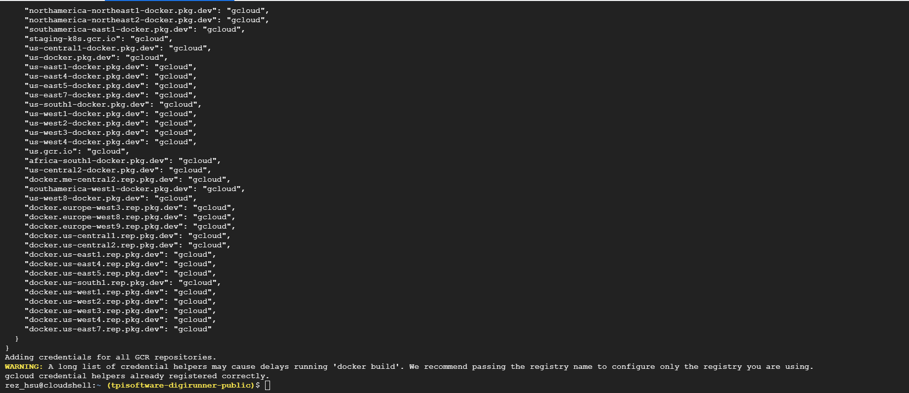<br><br>

# YAML Configuration Files 
The provided YAML files will:<br>
* Deploy an Ingress, and associate the domain with it
* Bind an SSL certificate to secure communication
* Connect to the database using `cloudsql_proxy`
* Configure Horizontal Pod Autoscaler (HPA)
* Deploy the digiRunner Keeper service

|Command Line|Description|
|-|-|
export IMAGE_DIGIRUNNER_APP='gcr.io/tpisoftware-digirunner-public/digirunner/digirunner:4.2.19'|Define the digiRunner application image version|
git clone https://github.com/TPIsoftware-digirunner/digirunner.git; cd digirunner/|Clone the Kubernetes YAML configuration repository|
envsubst < ./yaml/manifest_ingress.yaml > ./yaml/ingress.yaml|Specify the domain name in the Ingress manifest|
envsubst < ./yaml/manifest_managed_cert.yaml > ./yaml/managed_cert.yaml|Specify the domain name in the managed certificate manifest|
envsubst < ./yaml/manifest_cloudsql_proxy_mariadb.yaml > ./yaml/cloudsql_proxy_mariadb.yaml|Set up the Cloud SQL proxy manifest for MariaDB|
envsubst < ./yaml/manifest_cloudsql_proxy_svc.yaml > ./yaml/cloudsql_proxy_svc.yaml|Set up the Cloud SQL proxy service manifest|
envsubst < ./yaml/manifest_digi_hpa.yaml > ./yaml/digi_hpa.yaml|Set up the Horizontal Pod Autoscaler (HPA) manifest|
envsubst < ./yaml/manifest_keeper.yaml > ./yaml/keeper.yaml|Set up the digiRunner Keeper service manifest|

* Example Commands:
```
export IMAGE_DIGIRUNNER_APP='gcr.io/tpisoftware-digirunner-public/digirunner/digirunner:4.2.19'
git clone https://github.com/TPIsoftware-digirunner/digirunner.git; cd digirunner/
envsubst < ./yaml/manifest_ingress.yaml                > ./yaml/ingress.yaml
envsubst < ./yaml/manifest_managed_cert.yaml           > ./yaml/managed_cert.yaml
envsubst < ./yaml/manifest_cloudsql_proxy_mariadb.yaml > ./yaml/cloudsql_proxy_mariadb.yaml
envsubst < ./yaml/manifest_cloudsql_proxy_svc.yaml     > ./yaml/cloudsql_proxy_svc.yaml
envsubst < ./yaml/manifest_digi_hpa.yaml               > ./yaml/digi_hpa.yaml
envsubst < ./yaml/manifest_keeper.yaml                 > ./yaml/keeper.yaml
```
* Command Output:
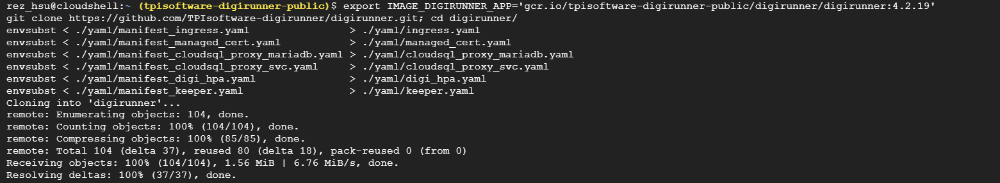<br><br>

# Secure Internal Connections with Cloud SQL Proxy
## Create Service Accounts and Grant Permissions
The following steps outline how to set up secure connections to Cloud SQL:
1. Create and configure the Google Cloud Service Account (GSA) and Kubernetes Service Account (KSA).
2. Grant permissions for your KSA to impersonate the GSA for use with Cloud SQL Proxy.

|Command Line|Description|User-defined Value|
|-|-|-|
kubectl create serviceaccount mysql-ksa --namespace $NAMESPACE|Create KSA|$NAMESPACE
gcloud iam service-accounts create mysql-gsa --project=$PROJECT_ID|Create GSA|$PROJECT_ID
gcloud projects add-iam-policy-binding $PROJECT_ID --member "serviceAccount:mysql-gsa@$PROJECT_ID.iam.gserviceaccount.com" --role "roles/cloudsql.client"|Grant the Cloud SQL client role to the GSA|$PROJECT_ID
gcloud projects add-iam-policy-binding $PROJECT_ID --member "serviceAccount:mysql-gsa@$PROJECT_ID.iam.gserviceaccount.com" --role "roles/iam.workloadIdentityPoolAdmin"|Grant the Workload Identity Pool Admin role to the GSA|$PROJECT_ID
gcloud projects add-iam-policy-binding $PROJECT_ID --member "serviceAccount:mysql-gsa@$PROJECT_ID.iam.gserviceaccount.com" --role "roles/container.admin"|Grant the Container Admin role to the GSA|$PROJECT_ID
gcloud projects add-iam-policy-binding $PROJECT_ID --member "serviceAccount:mysql-gsa@$PROJECT_ID.iam.gserviceaccount.com" --role "roles/iam.serviceAccountAdmin"|Grant the Service Account Admin role to the GSA|$PROJECT_ID
gcloud projects add-iam-policy-binding $PROJECT_ID --member "serviceAccount:mysql-gsa@$PROJECT_ID.iam.gserviceaccount.com" --role "roles/iam.serviceAccountTokenCreator"|Grant the Service Account Token Creator role to the GSA|$PROJECT_ID
gcloud projects add-iam-policy-binding $PROJECT_ID --member "serviceAccount:mysql-gsa@$PROJECT_ID.iam.gserviceaccount.com" --role "roles/iam.workloadIdentityUser"|Grant the Workload Identity User role to the GSA|$PROJECT_ID
gcloud iam service-accounts keys create ./key/gsa-key.json --iam-account mysql-gsa@$PROJECT_ID.iam.gserviceaccount.com|Generate a GSA key for cloudsql_proxy|$PROJECT_ID
kubectl create secret generic gsa-key --from-file=./key/gsa-key.json -n $NAMESPACE|Store the GSA key as a Kubernetes secret for secure Cloud SQL connections|$NAMESPACE
```
kubectl create serviceaccount mysql-ksa --namespace $NAMESPACE
gcloud iam service-accounts create mysql-gsa --project=$PROJECT_ID

gcloud projects add-iam-policy-binding $PROJECT_ID --member "serviceAccount:mysql-gsa@$PROJECT_ID.iam.gserviceaccount.com" --role "roles/cloudsql.client"
gcloud projects add-iam-policy-binding $PROJECT_ID --member "serviceAccount:mysql-gsa@$PROJECT_ID.iam.gserviceaccount.com" --role "roles/iam.workloadIdentityPoolAdmin"
gcloud projects add-iam-policy-binding $PROJECT_ID --member "serviceAccount:mysql-gsa@$PROJECT_ID.iam.gserviceaccount.com" --role "roles/container.admin"
gcloud projects add-iam-policy-binding $PROJECT_ID --member "serviceAccount:mysql-gsa@$PROJECT_ID.iam.gserviceaccount.com" --role "roles/iam.serviceAccountAdmin"
gcloud projects add-iam-policy-binding $PROJECT_ID --member "serviceAccount:mysql-gsa@$PROJECT_ID.iam.gserviceaccount.com" --role "roles/iam.serviceAccountTokenCreator"
gcloud projects add-iam-policy-binding $PROJECT_ID --member "serviceAccount:mysql-gsa@$PROJECT_ID.iam.gserviceaccount.com" --role "roles/iam.workloadIdentityUser"

gcloud iam service-accounts keys create ./key/gsa-key.json --iam-account mysql-gsa@$PROJECT_ID.iam.gserviceaccount.com
kubectl create secret generic gsa-key --from-file=./key/gsa-key.json -n $NAMESPACE
```
* Example Commands:
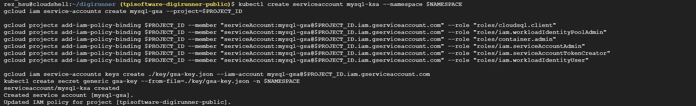
* Command Output:
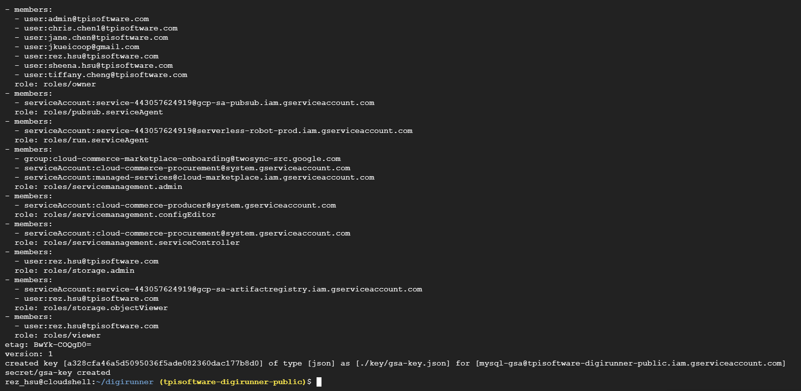

**NOTE**: This action should be performed along with exporting the variables in the previous commands:
```
# The environment variables set in Cloud Shell will be lost upon session termination. You must re-export environment variables after each session.
export CLUSTER_NAME="digi-cluster"
export DB_INSTANCE="digi-postgres"
export DB_PASSWORD="DeFault_pW"
export REGION="asia-east1"
export ZONE="asia-east1-a"
export LOCATION="asia-east1-a"
export PROJECT_ID=`gcloud config get-value project`
export PROJECT_NUM=`gcloud projects describe $PROJECT_ID --format="value(projectNumber)"`
export OPERATOR=`gcloud config get-value account`
export NAMESPACE="default"
```

## Deploy Cloud SQL Proxy Pod for Secure Database Connectivity
The Cloud SQL Auth Proxy enables secure connections to your Cloud SQL instance without the need for authorized networks or SSL configuration. Establish a secure connection to your Cloud SQL instance as instructed below.

* If you are using your own PostgreSQL database, modify the connection information in line 27 of the `cloudsql_proxy_mariadb.yaml` file.
```
kubectl apply -f ./yaml/cloudsql_proxy_svc.yaml
kubectl apply -f ./yaml/cloudsql_proxy_mariadb.yaml
```

## Bind KSA and GSA
Execute the following commands to bind the Kubernetes Service Account (KSA) to the Google Cloud Service Account (GSA).
|Command Line|Description|
|-|-|
kubectl annotate serviceaccount default iam.gke.io/gcp-service-account=$PROJECT_NUM-compute@developer.gserviceaccount.com|Assign a service account identity to Pods|
gcloud iam service-accounts add-iam-policy-binding $PROJECT_NUM-compute@developer.gserviceaccount.com --role roles/iam.workloadIdentityUser --member "serviceAccount:$PROJECT_ID.svc.id.goog[default/default]"|Grant GSA the necessary IAM role to access services|

```
kubectl annotate serviceaccount default iam.gke.io/gcp-service-account=$PROJECT_NUM-compute@developer.gserviceaccount.com

gcloud iam service-accounts add-iam-policy-binding $PROJECT_NUM-compute@developer.gserviceaccount.com \
    --role roles/iam.workloadIdentityUser \
    --member "serviceAccount:$PROJECT_ID.svc.id.goog[default/default]"
```
* Command Output:
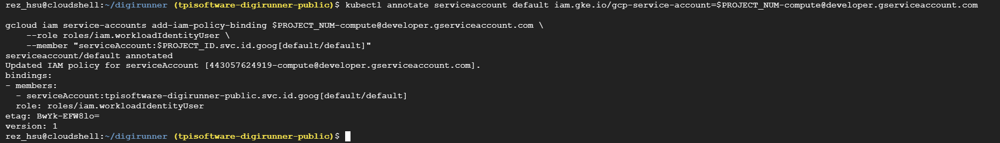<br><br>

# Deploy digiRunner Components
Before deploying the ingress, ensure SSL certificates are created. If not, run the following commands to create them for your domain.

|Command Line|Description|User-defined Value|
|-|-|-|
kubectl scale --replicas=0 deployment/digirunner; sleep 10|Temporarily scale replicas to 0, granting the keeper master privileges|
gcloud compute ssl-certificates create digi-cert --project=$PROJECT_ID --global --domains=$DIGI_DOMAIN|Create SSL certificates for the domain|$PROJECT_ID, $DIGI_DOMAIN
kubectl apply -f ./yaml/managed_cert.yaml|Apply the SSL certificates to Kubernetes|
kubectl apply -f ./yaml/ingress.yaml|Set up ingress and create GCP load balancer|
kubectl apply -f ./yaml/frontendconfig.yaml|Redirect HTTP to HTTPS|
kubectl apply -f ./yaml/digi_hpa.yaml|Set up Horizontal Pod Autoscaler (HPA)|
kubectl apply -f ./yaml/keeper.yaml|Deploy High Availability architecture; the keeper records the container role|

```
kubectl scale --replicas=0 deployment/digirunner; sleep 10
gcloud compute ssl-certificates create digi-cert --project=$PROJECT_ID --global --domains=$DIGI_DOMAIN

kubectl apply -f ./yaml/managed_cert.yaml
kubectl apply -f ./yaml/ingress.yaml
kubectl apply -f ./yaml/frontendconfig.yaml
kubectl apply -f ./yaml/digi_hpa.yaml
kubectl apply -f ./yaml/keeper.yaml
```

* Example Commands:
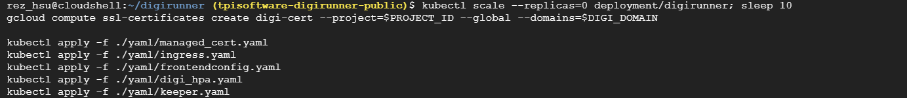
* Command Output:
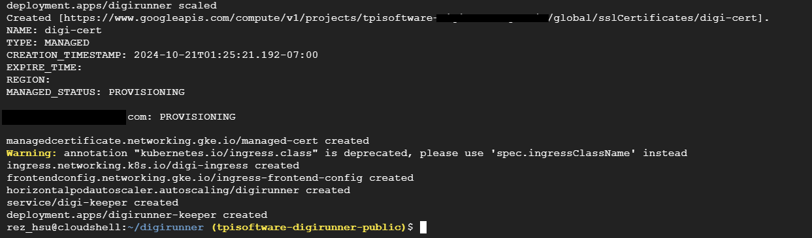

**NOTE:** Ensure to reference the previous variables: `$DIGI_DOMAIN`, and `$PROJECT_ID`.<br><br>


# Database Initialization and Configuration
1. Use the following job to initialize the database by inserting the schema and data rows.

|Description|User-defined Value|
|-|-|
|Insert schema and data rows| $DB_PASSWORD, $DB_INSTANCE

```
kubectl apply -f - << EOF
$(curl -s https://raw.githubusercontent.com/TPIsoftware-digirunner/initialize-script/main/sql-init.yaml | sed -e "s/sed_password/$DB_PASSWORD/g" -e "s/sed_instance/$DB_INSTANCE/g")
EOF
```
* Command Output:
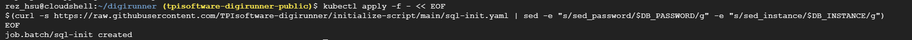

2. Use the following command to modify `configMap` for connecting to the PostgreSQL instance.

|Description|User-defined Value|
|-|-|
|Update the configMap with PostgreSQL connection settings| $NAMESPACE, $DB_PASSWORD|

```
kubectl get configmap properties-mounts -n $NAMESPACE -o yaml | sed "s/org.h2.Driver/org.postgresql.Driver/g ; s%jdbc:h2:mem:dgrdb;DB_CLOSE_DELAY=-1%jdbc:postgresql://cloudsql-proxy:5432/digirunner%g ; s/spring.datasource.username=sa/spring.datasource.username=postgres/g ; s/spring.datasource.password=/spring.datasource.password=$DB_PASSWORD/g ; s/spring.sql.init.mode=always/spring.sql.init.mode=never/g ; s/spring.jpa.database=h2/spring.jpa.database=PostgreSQL/g ; s/spring.h2.console.enabled=true/ /g" | kubectl replace -f -
```
 Command Output:
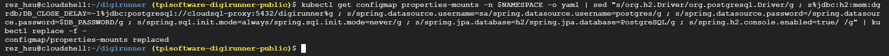

**NOTE:** Ensure to reference the previous variables: `$DB_INSTANCE`, `$DB_PASSWORD`, and `$NAMESPACE`.<br><br>

# Restart Deployments to Apply ConfigMap Changes
After editing the configMap, execute the following commands to apply the changes and connect to the Cloud SQL instance.

|Command Line|Description|User-defined Value|
|-|-|-|
kubectl rollout restart deployment digirunner-keeper -n $NAMESPACE|Restart the deployment to apply configMap changes|$NAMESPACE
kubectl rollout restart deployment digirunner -n $NAMESPACE|Restart the deployment to apply configMap changes|$NAMESPACE


```
kubectl rollout restart deployment digirunner-keeper -n $NAMESPACE
kubectl rollout restart deployment digirunner -n $NAMESPACE
```

 Command Output:
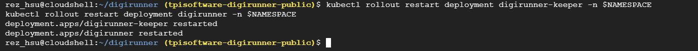

**NOTE:** Ensure to reference the previous variable: `$NAMESPACE`.<br><br>

# Scale the Replica Count for the digiRunner Application
Increase the replica count for the digirunner application to 2.

```
kubectl scale --replicas=2 deployment/digirunner
```

# digiRunner Installation Complete
Your digiRunner is now properly configured and ready to use.

