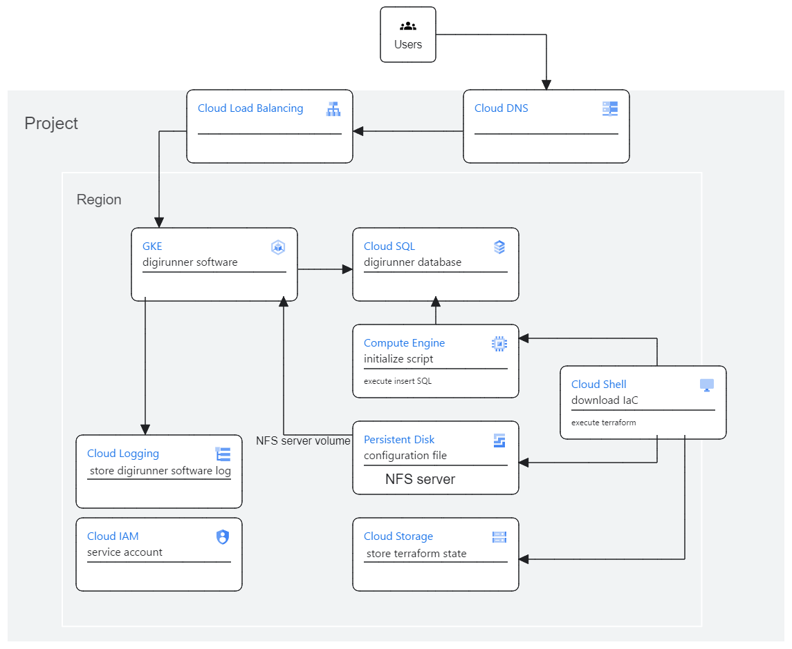

# Architecture


# Installation
## It is recommended to use cloud shell for installation
### Quick install with Google Cloud Marketplace

Install this digiRunner app to a Google Kubernetes Engine cluster using Google Cloud Marketplace. Follow the on-screen instructions.

## Prerequisites
1. You will need a PostgreSQL SQL database. You can either create your own DB and set up a connection, or you can follow the steps below to create one in GCP Cloud SQL.

```

# Replace the fields YOUR-INSTANCE-NAME, YOUR-PASSWORD, and ZONE.
# Create sql instances Example:
gcloud sql instances create [YOUR-INSTANCE-NAME] --database-version=POSTGRES_15 --cpu=2 --memory=3.75GiB --zone=[ZONE] --root-password=[YOUR-PASSWORD] --availability-type=zonal --edition=enterprise

# Create a database with the name "digirunner":
gcloud sql databases create digirunner --instance=[YOUR-INSTANCE-NAME] 
```

2. You will need a domain name. digiRunner uses encrypted connections, so you can follow the steps below to set up an SSL certificate.
---

# Command line instructions

## Set up command-line tools

You'll need the following tools in your development environment. If you are using Cloud Shell, then `gcloud`, `kubectl`, `terraform` are installed in your environment by default.

- [gcloud](https://cloud.google.com/sdk/gcloud/)
- [kubectl](https://kubernetes.io/docs/reference/kubectl/overview/)
- [terraform](https://developer.hashicorp.com/terraform?product_intent=terraform)
- [envsubst](https://command-not-found.com/envsubst)

### Configure gcloud as a Docker credential helper:
```
gcloud auth configure-docker
```
### Enable google apis
```
gcloud services enable cloudresourcemanager.googleapis.com
``` 

### digiRunner needs database and domain, setting up DB password and Domain name from command line:
```
# Please replace the following two variables what you require.
export DB_PASSWORD="DeFault_pW"
export DIGI_DOMAIN="your.domain.name"
```
### You can use the following commands to list and set the PROJECT_ID, PROJECT_NUMBER variables.
```
export PROJECT_ID=`gcloud config get-value project`
export PROJECT_NUM=`gcloud projects describe $PROJECT_ID --format="value(projectNumber)"`
export OPERATOR=`gcloud config get-value account`
```

---
### Create service account for terraform
```
gcloud iam service-accounts create tf-digi --display-name "tf-digi"
```

---
### Grant IAM roles
```
# VM-instance, GKE
gcloud projects add-iam-policy-binding $PROJECT_ID --member "serviceAccount:tf-digi@$PROJECT_ID.iam.gserviceaccount.com" --role "roles/compute.instanceAdmin"
# Kubernetes Engine Cluster Admin 
gcloud projects add-iam-policy-binding $PROJECT_ID --member "serviceAccount:tf-digi@$PROJECT_ID.iam.gserviceaccount.com" --role "roles/container.clusterAdmin"
# Cloud Storage Buckets
gcloud projects add-iam-policy-binding $PROJECT_ID --member "serviceAccount:tf-digi@$PROJECT_ID.iam.gserviceaccount.com" --role "roles/storage.admin"
# VPC, subnet
gcloud projects add-iam-policy-binding $PROJECT_ID --member "serviceAccount:tf-digi@$PROJECT_ID.iam.gserviceaccount.com" --role "roles/compute.networkAdmin"
# Global IP
gcloud projects add-iam-policy-binding $PROJECT_ID --member "serviceAccount:tf-digi@$PROJECT_ID.iam.gserviceaccount.com" --role "roles/compute.publicIpAdmin"
# Terraform query enable API
gcloud projects add-iam-policy-binding $PROJECT_ID --member "serviceAccount:tf-digi@$PROJECT_ID.iam.gserviceaccount.com" --role "roles/serviceusage.serviceUsageConsumer"
# Grant digiRunner Service Account using default compute Service Account
gcloud projects add-iam-policy-binding $PROJECT_ID --member "serviceAccount:tf-digi@$PROJECT_ID.iam.gserviceaccount.com" --role "roles/iam.serviceAccountUser"
# Kubernetes Engine Admin, Create k8s resource
gcloud projects add-iam-policy-binding $PROJECT_ID --member "serviceAccount:tf-digi@$PROJECT_ID.iam.gserviceaccount.com" --role "roles/container.admin"
# Container Threat Detection Service Agent, store key to GKE secret
gcloud projects add-iam-policy-binding $PROJECT_ID --member "serviceAccount:tf-digi@$PROJECT_ID.iam.gserviceaccount.com" --role "roles/containerthreatdetection.serviceAgent"
# gcloud sql instances patch
gcloud projects add-iam-policy-binding $PROJECT_ID --member "serviceAccount:tf-digi@$PROJECT_ID.iam.gserviceaccount.com" --role "roles/cloudsql.admin"
# Create Service Accounts and CloudSQL Service Accounts
gcloud projects add-iam-policy-binding $PROJECT_ID --member "serviceAccount:tf-digi@$PROJECT_ID.iam.gserviceaccount.com" --role "roles/iam.serviceAccountCreator"
# Security Reviewer 
gcloud projects add-iam-policy-binding $PROJECT_ID --member "serviceAccount:tf-digi@$PROJECT_ID.iam.gserviceaccount.com" --role "roles/iam.securityReviewer"
```
### Create a Cloud Storage Buckets
```
# Bucket name must be globally unique.
export TIME=`date +%s`
gsutil mb -p $PROJECT_ID -c STANDARD -l asia-east1 gs://tf-state-digi-$TIME
```
### Terraform state bucket
```
envsubst < manifest_backend > backend.tf
```

### Set up terraform variables to tfvars.
```
envsubst < manifest_terraform > terraform.tfvars
```

### Set up database password to manifest.
```
envsubst < manifest_postgresql > postgresql.tf
```

### Set up K8s namespace.
```
# default is digirunner.
export NAMESPACE="digirunner"
```

### Configure the container image
```
export IMAGE_DIGIRUNNER_APP="gcr.io/tpisoftware-digirunner-public/digirunner/deployer:4.2"
export IMAGE_COMPOSER_APP="gcr.io/tpisoftware-digirunner-public/composer/deployer:4.2"
```

### Set up domain name manifest to ingress and cert.
```
envsubst < ./yaml/manifest_ingress.yaml > ./yaml/ingress.yaml
envsubst < ./yaml/manifest_managed_cert.yaml > ./yaml/managed_cert.yaml
```

### Set up manifest to K8s yaml.
```
envsubst < ./yaml/manifest_cloudsql_proxy_mariadb.yaml > ./yaml/cloudsql_proxy_mariadb.yaml
envsubst < ./yaml/manifest_cloudsql_proxy_ksa.yaml     > ./yaml/cloudsql_proxy_ksa.yaml
envsubst < ./yaml/manifest_cloudsql_proxy_svc.yaml     > ./yaml/cloudsql_proxy_svc.yaml

envsubst < ./yaml/manifest_digi_deployment.yaml > ./yaml/digi_deployment.yaml
envsubst < ./yaml/manifest_composer_svc.yaml    > ./yaml/composer_svc.yaml
envsubst < ./yaml/manifest_digi_svc.yaml        > ./yaml/digi_svc.yaml
envsubst < ./yaml/manifest_digi_hpa.yaml        > ./yaml/digi_hpa.yaml
envsubst < ./yaml/manifest_keeper.yaml          > ./yaml/keeper.yaml
envsubst < ./yaml/manifest_keeper_svc.yaml      > ./yaml/keeper_svc.yaml
```

### To set up your Application resources, run the following command:
```
terraform init
terraform apply -auto-approve
```

---

### Set up your REGION and LOCATION

If necessary, you can modify it.
example:
```
export REGION="asia-east1"
export LOCATION="asia-east1-a"
```
### Fetch credentials for digirunner cluster
```
gcloud container clusters get-credentials digirunner --location $LOCATION
```

### Create a Google Cloud service account (GSA) and Kubernetes service account (KSA), Grant permissions for your Kubernetes service account (KSA) to impersonate the GSA (used by cloudsql_proxy)
Create KSA:
```
kubectl create serviceaccount mysql-ksa --namespace $NAMESPACE
```
Create GSA:
```
gcloud iam service-accounts create mysql-gsa --project=$PROJECT_ID
```
### Grant database service account roles
```
gcloud projects add-iam-policy-binding $PROJECT_ID --member "serviceAccount:mysql-gsa@$PROJECT_ID.iam.gserviceaccount.com" --role "roles/cloudsql.client"
gcloud projects add-iam-policy-binding $PROJECT_ID --member "serviceAccount:mysql-gsa@$PROJECT_ID.iam.gserviceaccount.com" --role "roles/iam.workloadIdentityPoolAdmin"
gcloud projects add-iam-policy-binding $PROJECT_ID --member "serviceAccount:mysql-gsa@$PROJECT_ID.iam.gserviceaccount.com" --role "roles/container.admin"
gcloud projects add-iam-policy-binding $PROJECT_ID --member "serviceAccount:mysql-gsa@$PROJECT_ID.iam.gserviceaccount.com" --role "roles/iam.serviceAccountAdmin"
gcloud projects add-iam-policy-binding $PROJECT_ID --member "serviceAccount:mysql-gsa@$PROJECT_ID.iam.gserviceaccount.com" --role "roles/iam.serviceAccountTokenCreator"
gcloud projects add-iam-policy-binding $PROJECT_ID --member "serviceAccount:mysql-gsa@$PROJECT_ID.iam.gserviceaccount.com" --role "roles/iam.workloadIdentityUser"
```

### Generic a service account key for cloudsql_proxy connection
```
mkdir -p ./key
gcloud iam service-accounts keys create ./key/gsa-key.json --iam-account mysql-gsa@$PROJECT_ID.iam.gserviceaccount.com
```
store gsa-key.json to GKE secret (is used by containers to connect to Cloud SQL)
```
kubectl create secret generic gsa-key --from-file=./key/gsa-key.json
```

### Create a initialize VM instances
If necessary, you can modify ZONE
```
export ZONE="asia-east1-a"

gcloud compute instances create digi-init-instance --zone=zone --image-family=debian-11 --image-project=debian-cloud --boot-disk-size=10GB --zone=$ZONE
```
### Create a Persistent Disk
```
gcloud compute disks create digi-config --size=10G --type=pd-standard --zone=$ZONE
```

### Deploy an SDK pod for initialization script
Please hold on a moment until the pod is ready
```
kubectl apply -f ./yaml/sdk.yaml
```

### Persistent Disk initialization and download configuration files
Please execute this shell script:
```
sh -x init_script.sh
```

### Deploy NFS, it will store digiRunner configuration file
Please hold on a moment until the pod is ready, you can check the pod status by executing the command `kubectl get pod`
```
kubectl apply -f ./yaml/nfs_server_pv_pvc.yaml
kubectl apply -f ./yaml/nfs_server_svc.yaml
kubectl apply -f ./yaml/nfs_server.yaml
```
then scale replicas to 1
```
kubectl scale deployment nfs-server --replicas=1
```

### Deploy the Cloud SQL proxy pod, a sidecar service used by digiRunner for database connectivity.

 - The Cloud SQL Auth Proxy provides secure access to your Cloud SQL instance without the need for authorized networks or for configuring SSL. By using the Cloud SQL Auth Proxy, you can connect to your Cloud SQL instance securely.

- If you have your own PostgreSQL database, you need to edit the connection information in line 27 of the `cloudsql_proxy_mariadb.yaml` file.
```
kubectl apply -f ./yaml/cloudsql_proxy_configMap.yaml
kubectl apply -f ./yaml/cloudsql_proxy_svc.yaml
kubectl apply -f ./yaml/cloudsql_proxy_mariadb.yaml
```

### Binding KSA and GSA
Service accounts provide an identity for processes that run in Pods
```
kubectl annotate serviceaccount default iam.gke.io/gcp-service-account=$PROJECT_NUM-compute@developer.gserviceaccount.com
```
Add an IAM binding to allow the GSA to access services.
```
gcloud iam service-accounts add-iam-policy-binding $PROJECT_NUM-compute@developer.gserviceaccount.com \
    --role roles/iam.workloadIdentityUser \
    --member "serviceAccount:$PROJECT_ID.svc.id.goog[default/default]"
```

### Deploy digiRunner software
```
# SSL certificates are required before deploying an ingress. Run the following command to create one for your domain.

gcloud beta compute ssl-certificates create digi-cert --project=$PROJECT_ID --global --domains=$DIGI_DOMAIN
```
```
kubectl apply -f ./yaml/composer_svc.yaml
kubectl apply -f ./yaml/composer_backendconfig.yaml
kubectl apply -f ./yaml/digi_svc.yaml
kubectl apply -f ./yaml/digi_backendconfig.yaml
kubectl apply -f ./yaml/managed_cert.yaml
kubectl apply -f ./yaml/ingress.yaml
```
Please hold on a moment until the ingress ready, then update frontendconfig and deploy the digiRunner
```
kubectl apply -f ./yaml/frontendconfig.yaml
kubectl apply -f ./yaml/digi_deployment.yaml
```
Deploying the High Availability version requires deploying the Horizontal Pod Autoscaler (HPA) and keeper YAML files.
```
kubectl apply -f ./yaml/digi_hpa.yaml
kubectl apply -f ./yaml/keeper_svc.yaml
kubectl apply -f ./yaml/keeper.yaml
```

# Initialize the database and insert the schema.
###  Install psql
```
gcloud compute ssh digi-init-instance --zone=$ZONE --project=$PROJECT_ID --command "sudo apt install -y postgresql postgresql-contrib jq"
BORDER_IP=`gcloud compute ssh digi-init-instance --zone=$ZONE --project=$PROJECT_ID --command "curl -s ipinfo.io | jq -r '.ip'"`
```
### Set up authorized networks
```
gcloud sql instances patch digi-postgres --authorized-networks=$BORDER_IP -q
```
### Download the sql schema
```
curl -X GET -H "Authorization: Bearer $(gcloud auth print-access-token)" -o "init_data.sql" \
"https://storage.googleapis.com/storage/v1/b/digirunner-config/o/init_data.sql?alt=media"
curl -X GET -H "Authorization: Bearer $(gcloud auth print-access-token)" -o "dgRv4-postgres-ddl-i18n.sql" \
"https://storage.googleapis.com/storage/v1/b/digirunner-config/o/dgRv4-postgres-ddl-i18n.sql?alt=media"
```
Copy .sql files to the initialize VM instances
```
gcloud compute scp dgRv4-postgres-ddl-i18n.sql digi-init-instance:~ --zone=$ZONE --project=$PROJECT_ID
gcloud compute scp init_data.sql digi-init-instance:~ --zone=$ZONE --project=$PROJECT_ID
```

### Fetch database IP, set up login password
```
gcloud sql instances describe digi-postgres --format="table[box](ipAddresses[].ipAddress)"
DB_IP=`gcloud sql instances describe digi-postgres --format="table[box](ipAddresses[].ipAddress)" | awk -F"'" '{print $2}'`
echo "$DB_IP:5432:digirunner:postgres:$DB_PASSWORD" > .pgpass
chmod 600 .pgpass
gcloud compute scp .pgpass digi-init-instance:~ --zone=$ZONE --project=$PROJECT_ID
```
### Insert tables, data
```
gcloud compute ssh digi-init-instance --zone=$ZONE --project=$PROJECT_ID --command \
"export PGPASSWORD=$DB_PASSWORD; \ 
psql -h $DB_IP -p 5432 -U postgres -d digirunner -f dgRv4-postgres-ddl-i18n.sql; \
psql -h $DB_IP -p 5432 -U postgres -d digirunner -f init_data.sql;"
```

### Modify the configMap to establish connections for the specified settings with the PostgreSQL instance.
`kubectl -n digirunner-deployer edit configmap properties-mounts`
```
# example:
spring.datasource.driverClassName=org.postgresqlDriver
spring.datasource.url=jdbc:postgresql:/cloudsql-proxy:5432/digirunner
spring.datasource.username=postgres
spring.datasource.password=[YOUR-DB-PASSWORD]
spring.jpa.database=PostgreSQL
```
### After editing the configMap, execute the following command to connect the DB connection to the Cloud SQL instance.
```
kubectl rollout restart deployment digirunner -n digirunner-deployer
```
### Delete the initialization VM instances once database initialization is complete.
```
gcloud compute instances delete digi-init-instance --zone=$ZONE --quiet
```
