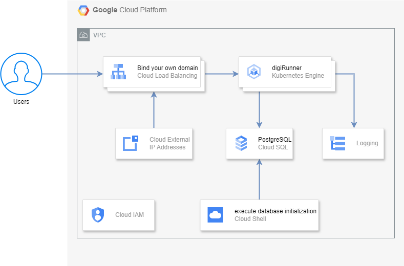

# Architecture


# Installation
### It is recommended to use cloud shell for installation

---

# Quick install with Google Cloud Marketplace

Install this digiRunner app to a Google Kubernetes Engine cluster using Google Cloud Marketplace. Follow the on-screen instructions.

# Prerequisites
### 1. You will need a `GKE cluster` and a`PostgreSQL` database. 
 - Use the following command to create `GKE cluster` and  `Cloud SQL` database.

 - digiRunner needs database and domain, setting up `DB password` and `Domain name`.
 - Replace the variable of `CLUSTER_NAME`, `DB_INSTANCE`, `DB_PASSWORD`, `REGION`, `ZONE` and `LOCATION`.
```
export CLUSTER_NAME="digi-cluster"
export DB_INSTANCE="digi-postgres"
export DB_PASSWORD="DeFault_pW"
export REGION="asia-east1"
export ZONE="asia-east1-a"
export LOCATION="asia-east1-a"
```
 - You can use the following commands to list and set the `PROJECT_ID`, `PROJECT_NUM` and `OPERATOR` variables. These variables will be referenced in subsequent steps.
```
export PROJECT_ID=`gcloud config get-value project`
export PROJECT_NUM=`gcloud projects describe $PROJECT_ID --format="value(projectNumber)"`
export OPERATOR=`gcloud config get-value account`
```
 - Set up a K8s namespace, where the `NAMESPACE` is determined during marketplace installation. The default value is `default` if not modified on the marketplace page.
```
export NAMESPACE="default"
```
 - Create GKE cluster. 
 - Minimum machine-type requirement is n2d-standard-2 or higher.
```
gcloud container clusters create $CLUSTER_NAME \
  --machine-type "n2d-standard-2" \
  --image-type "COS_CONTAINERD" \
  --disk-type "pd-ssd" \
  --disk-size "100GB" \
  --workload-pool "$PROJECT_ID.svc.id.goog" \
  --node-locations $LOCATION \
  --zone $ZONE
```
 - Set up node-pools name and enable Workload Identity.
```
export NODEPOOL_NAME=`gcloud container node-pools list --zone $ZONE --cluster $CLUSTER_NAME --format="value(name)"`
gcloud container node-pools update $NODEPOOL_NAME --cluster=$CLUSTER_NAME --region=$ZONE --workload-metadata=GKE_METADATA
```
 - Execute the following command create sql instances.
```
gcloud sql instances create $DB_INSTANCE --database-version=POSTGRES_15 --cpu=2 --memory=3.75GiB --zone=$ZONE --root-password=$DB_PASSWORD --availability-type=zonal --edition=enterprise
```

 - Create a database with the name `digirunner`, please don't edit this database name.
```
gcloud sql databases create digirunner --instance=$DB_INSTANCE
```
### `When you complete the above steps, you can click the CONFIGUE button on the marketplace page and select the GKE cluster created above to install digirunner.`


### 2. You will need a `Domain Name` and `external IP`. digiRunner uses encrypted connections, so you can follow the steps below to set up an `SSL certificate`. [Refer to this step.](#create-certificates)
 - digiRunner needs domain name.
 - Replace the variable of `DIGI_DOMAIN`.
 - Reserve a new static external IP address.
```
export DIGI_DOMAIN="your.domain.name"
gcloud compute addresses create dgr-ingress --global --ip-version=IPV4
```
### 3. Install the Application resource definition

An Application resource is a collection of individual Kubernetes components, such as Services, Deployments, and so on, that you can manage as a group.

To set up your cluster to understand Application resources, run the following command:
You need to run this command once.
```
gcloud container clusters get-credentials $CLUSTER_NAME --location $LOCATION
kubectl apply -f "https://raw.githubusercontent.com/GoogleCloudPlatform/marketplace-k8s-app-tools/master/crd/app-crd.yaml"
```


---

# Command line instructions

### Set up command-line tools

You'll need the following tools in your development environment. If you are using Cloud Shell, then `gcloud`, `kubectl`, `terraform` are installed in your environment by default.

- [gcloud](https://cloud.google.com/sdk/gcloud/)
- [kubectl](https://kubernetes.io/docs/reference/kubectl/overview/)
- [terraform](https://developer.hashicorp.com/terraform?product_intent=terraform)
- [envsubst](https://command-not-found.com/envsubst)

### Configure gcloud as a Docker credential helper:
```
gcloud auth configure-docker
```
### Enable google apis
```
gcloud services enable cloudresourcemanager.googleapis.com
``` 
---

# Clone the k8s yaml
```
git clone https://github.com/TPIsoftware-digirunner/digirunner.git
cd digirunner/
```
 - Set up domain name manifest to ingress and cert.
```
envsubst < ./yaml/manifest_ingress.yaml > ./yaml/ingress.yaml
envsubst < ./yaml/manifest_managed_cert.yaml > ./yaml/managed_cert.yaml
```
 - Set up manifest to K8s yaml.
```
envsubst < ./yaml/manifest_cloudsql_proxy_mariadb.yaml > ./yaml/cloudsql_proxy_mariadb.yaml
envsubst < ./yaml/manifest_cloudsql_proxy_svc.yaml     > ./yaml/cloudsql_proxy_svc.yaml

envsubst < ./yaml/manifest_digi_hpa.yaml        > ./yaml/digi_hpa.yaml
export IMAGE_DIGIRUNNER_APP='gcr.io/tpisoftware-digirunner-public/digirunner/digirunner:4.2.19'
envsubst < ./yaml/manifest_keeper.yaml          > ./yaml/keeper.yaml
```
# Using cloudsql_proxy for internal secure connections.
### Create a Google Cloud service account (GSA) and Kubernetes service account (KSA), Grant permissions for your Kubernetes service account (KSA) to impersonate the GSA (used by cloudsql_proxy)
Create KSA:
```
kubectl create serviceaccount mysql-ksa --namespace $NAMESPACE
```
Create GSA:
```
gcloud iam service-accounts create mysql-gsa --project=$PROJECT_ID
```
### Grant database service account roles
```
gcloud projects add-iam-policy-binding $PROJECT_ID --member "serviceAccount:mysql-gsa@$PROJECT_ID.iam.gserviceaccount.com" --role "roles/cloudsql.client"
gcloud projects add-iam-policy-binding $PROJECT_ID --member "serviceAccount:mysql-gsa@$PROJECT_ID.iam.gserviceaccount.com" --role "roles/iam.workloadIdentityPoolAdmin"
gcloud projects add-iam-policy-binding $PROJECT_ID --member "serviceAccount:mysql-gsa@$PROJECT_ID.iam.gserviceaccount.com" --role "roles/container.admin"
gcloud projects add-iam-policy-binding $PROJECT_ID --member "serviceAccount:mysql-gsa@$PROJECT_ID.iam.gserviceaccount.com" --role "roles/iam.serviceAccountAdmin"
gcloud projects add-iam-policy-binding $PROJECT_ID --member "serviceAccount:mysql-gsa@$PROJECT_ID.iam.gserviceaccount.com" --role "roles/iam.serviceAccountTokenCreator"
gcloud projects add-iam-policy-binding $PROJECT_ID --member "serviceAccount:mysql-gsa@$PROJECT_ID.iam.gserviceaccount.com" --role "roles/iam.workloadIdentityUser"
```

### Generic a service account key for cloudsql_proxy connection
```
gcloud iam service-accounts keys create ./key/gsa-key.json --iam-account mysql-gsa@$PROJECT_ID.iam.gserviceaccount.com
```
store gsa-key.json to GKE secret (is used by containers to connect to Cloud SQL)
```
kubectl create secret generic gsa-key --from-file=./key/gsa-key.json -n $NAMESPACE
```
### Deploy the Cloud SQL proxy pod, a sidecar service used by digiRunner for database connectivity.

 - The Cloud SQL Auth Proxy provides secure access to your Cloud SQL instance without the need for authorized networks or for configuring SSL. By using the Cloud SQL Auth Proxy, you can connect to your Cloud SQL instance securely.

- If you have your own PostgreSQL database, you need to edit the connection information in line 27 of the `cloudsql_proxy_mariadb.yaml` file.
```
kubectl apply -f ./yaml/cloudsql_proxy_svc.yaml
kubectl apply -f ./yaml/cloudsql_proxy_mariadb.yaml
```

### Binding KSA and GSA
Service accounts provide an identity for processes that run in Pods
```
kubectl annotate serviceaccount default iam.gke.io/gcp-service-account=$PROJECT_NUM-compute@developer.gserviceaccount.com
```
Add an IAM binding to allow the GSA to access services.
```
gcloud iam service-accounts add-iam-policy-binding $PROJECT_NUM-compute@developer.gserviceaccount.com \
    --role roles/iam.workloadIdentityUser \
    --member "serviceAccount:$PROJECT_ID.svc.id.goog[default/default]"
```

# Deploy digiRunner `cert` and `ingress`
### create certificates
 - SSL certificates are required before deploying an ingress. Run the following command to create one for your domain.
```
gcloud compute ssl-certificates create digi-cert --project=$PROJECT_ID --global --domains=$DIGI_DOMAIN
```
```
kubectl apply -f ./yaml/managed_cert.yaml
kubectl apply -f ./yaml/ingress.yaml
```
Please hold on a moment until the ingress ready, then update frontendconfig.
Frontendconfig is used to redirect `http` to `https`.
```
kubectl apply -f ./yaml/frontendconfig.yaml
```
### Temporarily set the replica count of the digirunner application to zero.
```
kubectl scale --replicas=0 deployment/digirunner
```
### Deploying the High Availability architecture, Horizontal Pod Autoscaler (HPA) and keeper YAML files.
```
kubectl apply -f ./yaml/digi_hpa.yaml
kubectl apply -f ./yaml/keeper.yaml
```

# Initialize the database and insert the schema.
### Use job to initialize database
```
kubectl apply -f - << EOF
$(curl -s https://raw.githubusercontent.com/TPIsoftware-digirunner/initialize-script/main/sql-init.yaml | sed -e "s/sed_password/$DB_PASSWORD/g" -e "s/sed_instance/$DB_INSTANCE/g")
EOF
```

### Modify the configMap to establish connections for the specified settings with the PostgreSQL instance.

### Use the following command to replace.
```
kubectl get configmap properties-mounts -n $NAMESPACE -o yaml | sed "s/org.h2.Driver/org.postgresql.Driver/g ; s%jdbc:h2:mem:dgrdb;DB_CLOSE_DELAY=-1%jdbc:postgresql://cloudsql-proxy:5432/digirunner%g ; s/spring.datasource.username=sa/spring.datasource.username=postgres/g ; s/spring.datasource.password=/spring.datasource.password=$DB_PASSWORD/g ; s/spring.sql.init.mode=always/spring.sql.init.mode=never/g ; s/spring.jpa.database=h2/spring.jpa.database=PostgreSQL/g ; s/spring.h2.console.enabled=true/ /g" | kubectl replace -f -
```
# After editing the configMap, execute the following command to connect the DB connection to the Cloud SQL instance.
```
kubectl rollout restart deployment digirunner-keeper -n $NAMESPACE
kubectl rollout restart deployment digirunner -n $NAMESPACE
```
# Increase the replica count of the digirunner application to 2.
```
kubectl scale --replicas=2 deployment/digirunner
```
